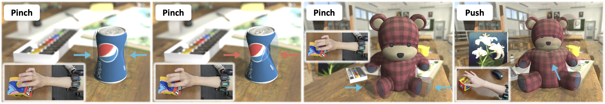

## Force-Aware Interface via Electromyography for Natural VR/AR Interaction (SIGGRAPH Asia 2022)

[Yunxiang Zhang](https://yunxiangzhang.github.io/), Benjamin Liang, Boyuan Chen, [Paul M. Torrens](https://engineering.nyu.edu/faculty/paul-torrens), [S. Farokh Atashzar](https://engineering.nyu.edu/faculty/s-farokh-atashzar), [Dahua Lin](http://dahua.site/), [Qi Sun](https://qisun.me/)

[\[Paper\]](https://www.immersivecomputinglab.org/wp-content/uploads/2022/10/xr-emg-force-interface.pdf) [\[Project Page\]](https://www.immersivecomputinglab.org/publication/force-aware-interface-via-electromyography-for-natural-vr-ar-interaction/) [\[Video\]](https://www.youtube.com/watch?v=Y95LgJT0-Ks)




While tremendous advances in visual and auditory realism have been made for virtual and augmented reality (VR/AR), introducing a plausible sense of physicality into the virtual world remains challenging. Closing the gap between real-world physicality and immersive virtual experience requires a closed interaction loop: applying user-exerted physical forces to the virtual environment and generating haptic sensations back to the users. However, existing VR/AR solutions either completely ignore the force inputs from the users or rely on obtrusive sensing devices that compromise user experience.

By identifying users' muscle activation patterns while engaging in VR/AR, we design a learning-based neural interface for natural and intuitive force inputs. Specifically, we show that lightweight electromyography sensors, resting non-invasively on users' forearm skin, inform and establish a robust understanding of their complex hand activities. Fuelled by a neural-network-based model, our interface can decode finger-wise forces in real-time with 3.3% mean error, and generalize to new users with little calibration. Through an interactive psychophysical study, we show that human perception of virtual objects' physical properties, such as stiffness, can be significantly enhanced by our interface. We further demonstrate that our interface enables ubiquitous control via finger tapping. Ultimately, we envision our findings to push forward research towards more realistic physicality in future VR/AR.

## Usage

1. Download the dataset at [google drive](https://drive.google.com/file/d/1ECcikftUhi70a9zK4yeVU8jIGpUgh9Q5/view?usp=sharing).
2. Move extracted `Data/` and `Dataset/` folders to the project directory.
3. (Optional) Re-generate the dataset: `python processing.py`
4. Train and evaluate the model: `python main.py`

For further details about the model, please refer to [our paper](https://www.immersivecomputinglab.org/wp-content/uploads/2022/10/xr-emg-force-interface.pdf).

## Citation

If you find this work useful for your research, please consider citing [BibTeX](Docs/xr-emg-force-interface.bib):

```bibtex
@article{zhang2022force,
  title={Force-aware interface via electromyography for natural VR/AR interaction},
  author={Zhang, Yunxiang and Liang, Benjamin and Chen, Boyuan and Torrens, Paul M and Atashzar, S Farokh and Lin, Dahua and Sun, Qi},
  journal={ACM Transactions on Graphics (TOG)},
  volume={41},
  number={6},
  pages={1--18},
  year={2022},
  publisher={ACM New York, NY, USA}
}
```